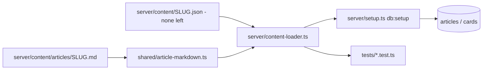

# Latent: project overview (post content rewrite)

Updated 2026-09-27 after the full curriculum restructure and text rewrite. This replaces the content and curriculum parts of `summary.md`. Operational details that didn't change (auth, API, scheduler, farm example, Tailscale, launchers) are condensed here; `summary.md` still has the long-form history and validation record. Source, the lockfile, and PostgreSQL are authoritative over both documents.

## What the app is

Latent is a personal learning app for **senior-level AI/LLM interviews**, aimed at an experienced software engineer who is new to ML. It pairs long-form articles with spaced-repetition recall decks, progress tracking, and a small concept lab. Stack: React 19 + Vite + TypeScript, TanStack Router/Query, shadcn/ui (Radix Nova, all 61 components installed), Express 5, PostgreSQL (`ai` database, `ailearn` schema). Single login **Admin / 123**. The app itself never calls an LLM. The "corporate AI farm" is teaching content, not infrastructure.

| Item | Value |
|---|---|
| Project | `C:\Users\John\Documents\ai learning` |
| Production | `http://127.0.0.1:3002/` (Express serves `/api` + `dist`) |
| Phone (private Tailscale Serve) | `https://momentdesktop.tail01307d.ts.net:10001/` |
| Dev | `npm.cmd run dev` → Vite on 5174 proxying to 3002 (stop production first) |

## Content philosophy (new)

Every article was rewritten from scratch with one voice: **a senior engineer teaching a sharp new hire at a whiteboard**. The style is casual and direct, while the substance stays interview-grade. The rules, enforced in `server/content/AUTHORING.md`:

- **Self-contained.** Every term is defined in plain words on first use. Anything owned by another article gets a one- or two-sentence intuition plus "we'll go through this in detail in **Exact Title**".
- **Intuition → tiny example with real numbers → precise mechanism → consequence/tradeoff.** Worked arithmetic is rechecked, and illustrative numbers are labelled as illustrative.
- **Drawings everywhere.** The articles use ASCII sketches (` ```text `), Markdown tables, and plain-Unicode equations (` ```formula `).
- **Animation placeholders.** The old diagrams and SVG walkthroughs are *not* shown in the rewritten articles. Each article instead has 7–9 `> 🎬 **Animation — name:** …` notes that describe exactly what a future visual should show, step by step, with toy numbers. There are **164 placeholders** in total. These are the brief for the upcoming visuals pass.
- **Consistent notation and scope** come from `server/content/CURRICULUM.md`, which is the canonical map of what each article owns, the exact titles, and the shared symbols (`T, B, V, d, h, d_head, h_kv, L, N, D`).
- Facts that depend on a version or date were checked against primary sources the writers opened. Each article has 6–13 sources.

## Curriculum: 9 categories, 21 articles

The structure was reviewed and changed from 8 categories and 18 articles. The main changes:

- The monolithic transformer article was split into three.
- The KV cache is now introduced (in serving) *before* efficient attention uses it.
- MoE was separated from general parallelism, which became a new distributed-training article.
- Training got its own category.

| # | Category | Slug | Title | Sections / prose words / cards |
|---|---|---|---|---|
| 1 | How LLMs work | `tokens-and-embeddings` *(new)* | Text in, next token out: tokens, embeddings, and sampling | 9 / 3.8k / 16 |
| 2 | | `attention-from-scratch` *(new)* | Attention from scratch: how tokens talk to each other | 9 / 3.4k / 15 |
| 3 | | `transformer-foundations` | The transformer block: assembling the full model | 9 / 3.3k / 15 |
| 4 | Training *(new category)* | `optimization-generalization` | How a model learns: loss, gradients, and optimizers | 9 / 4.4k / 16 |
| 5 | | `pretraining-data-scaling` | Pretraining: data, compute, and scaling laws | 9 / 3.6k / 15 |
| 6 | | `distributed-training` *(new)* | Distributed training: fitting a training run onto a cluster | 9 / 4.3k / 14 |
| 7 | Post-training | `post-training-alignment` | From base model to assistant: SFT, RLHF, DPO, and verifiable rewards | 9 / 4.2k / 16 |
| 8 | | `parameter-efficient-finetuning` | Fine-tuning on a budget: LoRA and QLoRA | 9 / 3.7k / 16 |
| 9 | Inference & serving | `serving-kv-cache` | What happens at inference: prefill, decode, and the KV cache | 9 / 4.1k / 15 |
| 10 | | `inference-scheduling` | Serving many users: batching, scheduling, and speculative decoding | 9 / 4.3k / 16 |
| 11 | Efficiency levers | `efficient-attention` | Making attention cheaper: GQA, FlashAttention, and long context | 9 / 3.3k / 16 |
| 12 | | `quantization-and-compression` | Quantization: spending fewer bits per weight | 10 / 3.7k / 16 |
| 13 | | `moe-and-parallelism` | Mixture of experts: more parameters, same compute per token | 8 / 3.6k / 16 |
| 14 | RAG & agent systems | `rag-retrieval` | RAG: giving the model the right evidence | 9 / 4.0k / 16 |
| 15 | | `agents-tool-systems` | Agents and tools: from model decisions to safe actions | 10 / 3.6k / 16 |
| 16 | Evaluation & safety | `evaluation-observability` | Evaluation and observability: knowing whether it actually works | 10 / 4.7k / 16 |
| 17 | | `llm-security` | LLM security: treating model output as untrusted | 8 / 3.8k / 16 |
| 18 | The corporate AI farm | `farm-blueprint` | AI farm, part 1: designing a two-server Qwen deployment | 10 / 4.3k / 16 |
| 19 | | `farm-deployment` | AI farm, part 2: deploying it with Docker, step by step | 10 / 4.8k / 16 |
| 20 | | `farm-routing-consistency` | AI farm, part 3: routing and keeping conversations consistent | 10 / 5.1k / 15 |
| 21 | System design interview | `interview-design` | The senior LLM system design interview (a full 45-minute mock, with numbers) | 9 / 3.7k / 16 |

Totals: **193 sections, ~84k words of prose** (excluding drawings, tables and placeholders), **329 flashcards**, and 164 animation placeholders. The old curriculum had ~32k words. Category slugs `architecture` ("Efficiency levers") and `alignment` ("Post-training") kept their slugs and got new display names. `training` is the only new category slug.

Existing slugs were kept wherever an article survived, so bookmarks, read state and enrollments carry over. Writers reused old flashcard keys where a concept carried over, which preserves review history for those cards.

## Content pipeline (new format)



- **One Markdown file per article**: `server/content/articles/SLUG.md`. A JSON front-matter block holds the metadata (slug, title, category, summary, difficulty, minutes, prerequisites, learningObjectives). The body has fixed top-level parts: `# Sections` (each `## Title {#id}`), `# Interview` (`## Question/Answer/Follow-ups`), `# Pitfalls`, `# Checklist`, `# Sources` (`- [Title](https) — note`), and `# Flashcards` (`## key`, then `**Q:** front`, then the answer).
- The parser (`shared/article-markdown.ts`, fence-aware) produces the same `Article` shape as before, so the frontend contract (`shared/content.ts`) is unchanged. Each blank-line-separated block becomes one `paragraphs[]` entry, so the later visuals pass can still use `visuals: [{id, afterParagraph}]` placements.
- A `.md` file overrides a legacy `server/content/SLUG.json` with the same slug. All 18 legacy JSON files now live in **`server/content/legacy/`**, which the loader does not read. They're kept as reference for the visuals pass, since they hold the old `diagram` data and walkthrough placement IDs. `legacy/transformer-foundations.json` includes the last uncommitted edits.
- `node scripts/check-article.ts SLUG` validates one article: sections, words, placeholders, 12–16 unique cards, sources, fences with a language, and valid category and prerequisites.
- Markdown rendering (`src/common.tsx`) now uses `remark-gfm` (tables). ` ```formula ` renders as the equation box, ` ```text ` as a scrollable sketch, other languages as the copyable `CodeBlock`, and blockquotes (the 🎬 placeholders) as dashed callouts (`src/styles.css`).

### Card retirement (schema version 2)

Rewrites drop some old card keys. Deleting those cards would cascade into review history, so `schema.sql` now adds `cards.retired boolean` (idempotent `ALTER … IF NOT EXISTS`, migration marker 2). On `db:setup`, a card whose key is no longer in its article's source is marked `retired`, and a card that comes back is un-retired. Retired cards are excluded from article decks, enrollment, review queues, and stats counts and forecasts. They remain in recent review history.

## Visual system status

- The SVG walkthrough engine (`src/VisualLesson.tsx`, `shared/visuals/*`, 38 walkthroughs) and the `Diagram` renderer are **intact but unused** by the rewritten articles. No article currently places a walkthrough or a `diagram`.
- `tests/visuals.test.ts` still validates every walkthrough's geometry and arithmetic, and any placements that exist. The "every foundations section has a visual" and "no unplaced walkthrough" rules were removed for the placeholder phase.
- The article header hides the diagram count when it's zero. The dashboard's "visual explanations" counter currently reads 0.
- **Next phase:** build new visuals from the 🎬 briefs. Reuse or adapt the existing walkthroughs where they fit (legacy placement IDs are in `server/content/legacy/*.json`). Place them with `visuals` on sections, or extend the Markdown format with a placement marker. Then reinstate coverage tests.

## Code map (changes in bold)

| Path | Responsibility |
|---|---|
| **`server/content/articles/*.md`** | The curriculum: one Markdown article each |
| **`server/content/AUTHORING.md`** | Voice, self-containment rules, file format, checks |
| **`server/content/CURRICULUM.md`** | What each article owns, exact titles, shared notation |
| **`server/content/legacy/`** | Old JSON articles (reference only, not loaded) |
| `server/content/FARM-CONTRACT.md`, `examples/ai-farm/` | Farm guide contract and downloadable reference (unchanged) |
| **`shared/article-markdown.ts`** | Markdown → `Article` parser |
| **`server/content-loader.ts`** | Loads Markdown + any legacy JSON; used by setup and tests |
| **`scripts/check-article.ts`** | Per-article validator |
| **`shared/catalog.ts`** | 9 categories and the 21-article order |
| `shared/content.ts` | Article/section types (unchanged) |
| **`server/setup.ts`, `server/schema.sql`** | Seeding via the loader; card retirement (schema v2) |
| **`server/app.ts`** | Retired cards filtered from decks, enrollment, review, stats |
| **`src/common.tsx`, `src/styles.css`** | GFM Markdown, formula/sketch/code blocks, callouts, tables; new category icons |
| **`src/ThemeContext.tsx`** | Added the `category-training` colour |
| `src/ArticlePage.tsx` | Reader; diagram count hidden when 0 |
| `src/VisualLesson.tsx`, `src/Diagram.tsx`, `shared/visuals/*` | Visual engines, dormant until the visuals pass |
| `src/Review.tsx`, `src/Progress.tsx`, `src/Lab.tsx`, `src/Learn.tsx`, `src/Shell.tsx` | Review, progress/guide, lab, catalog, shell (unchanged) |
| `server/scheduler.ts`, `server/password.ts`, `server/db.ts`, `server/index.ts` | SM-2 scheduling, auth, DB, listener (unchanged) |

## Unchanged behaviour (short form)

- **Auth:** salted scrypt, 32-byte session token stored hashed, `latent_session` HttpOnly SameSite=Lax cookie (30 days), Origin allow-list from `.env`, 32 KB JSON limit, Zod validation, process-local login throttle.
- **API:** `/api/health, login, logout, me, catalog, articles/:slug (+/progress, /enroll), review, reviews, stats`. Contracts are as in `summary.md`.
- **Reviews:** per-user row lock; `requestId` replay check before the version check; server-side SM-2 (ease 2.5, min 1.3, 1d → 6d → interval×ease); grades 0–5, with <3 counted as a miss; same-session practice repeats until Good/Easy without changing the schedule. "Established" means ≥3 consecutive successes and an interval of ≥21 days.
- **Farm example:** browser → Nginx → 2 stateless Express replicas → 2 llama.cpp/Qwen hosts, with Postgres owned by Express. Tested only against a fake upstream. Rebuild the zip with `npm.cmd run bundle:examples`.

## Running and maintaining

```powershell
npm.cmd ci                       # exact lockfile install (remark-gfm was added)
node scripts/check-article.ts <slug>
npm.cmd test                     # 10 unit/content/visual tests, no DB needed
npm.cmd run db:setup             # seed content into the real DB (non-destructive; retires removed cards)
npm.cmd run build
.\stop.cmd; .\start.cmd          # backend changes need a restart; frontend needs a browser refresh
```

To add or rewrite an article: follow `AUTHORING.md`, add the slug to `CURRICULUM.md` and `shared/catalog.ts`, run check-article, run the tests, then `db:setup`. Keep slugs and card keys stable for wording fixes. `npm.cmd run test:integration` seeds the real database and creates/removes a disposable user. It was **not** run during this rewrite.

## Validation of this rewrite (2026-09-27)

- All 21 articles pass `check-article`. `npm.cmd test` passes 10/10, and `npm.cmd run build` is clean.
- `db:setup` seeded **21 articles / 329 cards** into the live database. The server was restarted and `/api/health` is OK. `/api/catalog` returns 21 articles, and `/api/articles/transformer-foundations` returns 15 live cards matching its 15 flashcards (retired cards are excluded).
- **Not done:** browser/mobile visual QA of the new Markdown rendering (tables, sketches, callouts), the integration suite, and a cross-article editorial read for consistency. Writers verified sources individually, but no second reviewer checked every article's facts.
- Two noted source limitations: the NIST AI 600-1 citation relies on the landing page (the PDF wouldn't render), and the interview article cites the AWS jitter blog instead of the Builders' Library PDF.
