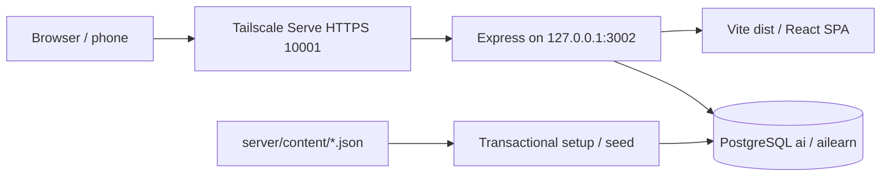

# Latent — project summary and agent handoff

Updated 2026-09-25 after the structural visual-learning rollout. Read this before working on the app, then inspect the relevant source. This describes **this project**, not the earlier hardware-learning application that inspired it. Runtime state, dependency versions, and user progress may change; source, the lockfile, and PostgreSQL are authoritative.

## Purpose and user requirements

Latent is a personal learning application for **senior-level AI/LLM interviews**. It combines substantial technical articles, mathematical examples, diagrams, interview scenarios, flashcards, spaced repetition, and progress tracking.

The requested stack is implemented: React, Vite, TypeScript, TanStack, Express, Tailwind, and PostgreSQL. The user explicitly requested **only Astra agents**, with **one Astra content agent per article using web search to verify content** for the initial curriculum. That curriculum followed the requested workflow, including opened primary/official sources. Preserve the Astra-only requirement for delegated work unless the user changes it. Articles need at least **five diagrams**; current articles have six to nine.

The user's subsequent visual-learning requirement is to accompany each new transformer-architecture concept with a picture or step-by-step animation showing its structure. Use original, small, readable matrices, vectors, connections and geometric examples; shape notation alone is insufficient. Keep useful existing diagrams and prose. Supplied video screenshots were conceptual references, not assets to copy. The completed update used only Astra agents and added the walkthroughs described below.

The user wants a basic personal login, **Admin / 123**. Enterprise identity, registration, SSO, password recovery, and account-management screens were not requested. Do not expand auth scope without a reason grounded in a new request.

**The corporate AI farm is educational content, not the running application's infrastructure.** The learning app does not call an LLM, download a model, or run inference containers. The three farm guides and downloadable examples teach a separate Linux Docker deployment.

The original build used a document called `summaryoldanotherproject.md` describing Fieldnotes in `C:\Users\John\Documents\hw`. If that document is encountered, treat it as historical design inspiration. Do not adopt that project's database, port, identity-header approach, or file paths for this app.

## Current endpoints and environment

| Item | Value |
|---|---|
| Project directory | `C:\Users\John\Documents\ai learning` |
| Production local URL | `http://127.0.0.1:3002/` |
| Private phone URL | `https://momentdesktop.tail01307d.ts.net:10001/` |
| Login | `Admin` / `123`; username comparison is case-insensitive |
| PostgreSQL | Existing database `ai`, application schema `ailearn` |
| Local DB defaults | `127.0.0.1:5432`, role `postgres`, password `123`; see `.env` |
| Development frontend | `http://127.0.0.1:5174/`, proxying `/api` to port 3002 |
| Production process | Hidden Node process managed by the supplied Windows launchers |

Node and PostgreSQL were already installed. The initial environment had Node 24.19.0 and PostgreSQL 18. The backend runs erasable TypeScript directly with Node 24; it is not compiled into a separate server build. `tsx` remains installed as a development dependency but is not used by the current scripts.

Lockfile versions checked while writing this summary: React 19.3.0, Vite 8.3.1, TypeScript 7.0.2, TanStack Query 5.103.2, TanStack Router 1.170.39, Express 5.2.1, Tailwind 4.3.3, `pg` 8.23.0, and Zod 4.6.5. `package.json` uses `latest` ranges for these dependencies; **use `npm.cmd ci` to reproduce `package-lock.json`**, rather than unintentionally upgrading everything.

The local health endpoint was last checked at completion of the visual-learning rollout and returned `{ok:true, app:"latent", database:"ai", version:"1.0.0"}`. The initial build's HTTPS checks are recorded below; they were not repeated for the visual update or this documentation refresh. Do not assume any historical PID or an empty Admin history remains current.

## Delivered functionality

- Eight disciplines, 18 articles, **120 diagrams**, and **252 flashcards**: 14 cards per article. Source section paragraphs total approximately **31,972 words**, excluding diagrams, code, checklists, cards, and source notes.
- **38 original structural visual walkthroughs with 126 steps across 11 articles**, in addition to those diagrams. Every transformer-foundations section has visual coverage; existing prose, diagrams and recall cards are preserved.
- Searchable learning path, category pages, unread/bookmarked/enrolled filters, and a suggested next unread article.
- Article reader with objectives, prerequisite links, formulas, code-copy controls, responsive diagrams, embedded visual players, section outline, expandable interview answers, pitfalls, checklist, and primary-source links.
- Reading state and bookmarks saved independently from deck enrollment.
- Recall-deck previews with individual card state, explicit enrollment, due-first sessions, six recall grades, answer reveal, keyboard shortcuts, and practice repeats.
- PostgreSQL persistence, session authentication, atomic/idempotent reviews, and optimistic card-version checks for multiple devices.
- Progress page with coverage, accuracy, established cards, time, activity, upcoming due cards, and recent review history.
- Study guide explaining scheduling and persistence.
- Concept lab with interactive KV-memory sizing, a quadratic gradient-descent experiment, and token-workload/Little's-law calculations.
- Three farm guides, an example zip download, Windows start/stop scripts, and private Tailscale Serve access.

## Runtime architecture and routes

The browser is a React SPA using **TanStack Router** for typed path routes and **TanStack Query** for server state. In production, Express serves both `/api` and Vite's `dist` assets from loopback port 3002. PostgreSQL is a separate installed service. In development, `concurrently` starts the Node watch process and Vite on port 5174.



| Route | Screen |
|---|---|
| `/` | Learning path and search |
| `/category/:slug` | Discipline articles |
| `/lesson/:slug` | Article and recall-deck tabs |
| `/review` | Review enrolled decks |
| `/review?deck=:slug` | Review a particular deck |
| `/progress` | Coverage, history, and review metrics |
| `/lab` | Interactive concept experiments |
| `/guide` | Learning-flow and scheduling guide |

`src/main.tsx` creates the route tree, enables scroll restoration, and lazily loads article, review, progress/guide, and lab screens. `Shell` queries `/api/me`; a 401 shows the login screen. TanStack Query defaults to a 30-second stale time, refetch on focus, and one query retry. Study mutations invalidate catalog, stats, and article queries. The app has no persistent offline study queue; committed state lives in PostgreSQL.

## Code map

Paths below are relative to the project directory.

| Path | Responsibility |
|---|---|
| `src/main.tsx` | React root, query provider, typed route tree, lazy route loading |
| `src/Shell.tsx` | Login, authenticated shell, sidebar/mobile navigation, logout |
| `src/api.ts` | Fetch helper, typed API responses, query client, study invalidation |
| `src/Learn.tsx` | Catalog, search/filtering, discipline grouping, article cards |
| `src/ArticlePage.tsx` | Article reader, outline, progress/bookmark/enroll controls, deck preview, farm download |
| `src/Diagram.tsx` | Responsive flow/comparison cards, bars, and SVG curve charts |
| `src/VisualLesson.tsx` | SVG walkthrough renderer, playback/stepping, accessibility and motion lifecycle |
| `src/visual-lessons.css` | Walkthrough layout, transitions, mobile panning and reduced-motion styles |
| `src/Review.tsx` | Review setup, transient queue, reveal/grade/retry/conflict handling, completion |
| `src/Progress.tsx` | Progress metrics/charts/history and study guide |
| `src/Lab.tsx` | KV, gradient-descent, and token-workload experiments |
| `src/common.tsx` | Markdown, code blocks, icons, loading/error/empty UI |
| `src/styles.css` | Tailwind import, dark visual system, responsive layouts and general component styling |
| `server/index.ts` | DB readiness, loopback listener, shutdown hooks |
| `server/app.ts` | `createApp()`, sessions, validation, SQL/API, static SPA serving |
| `server/db.ts` | `.env` loading, PostgreSQL pool/search path |
| `server/password.ts` | Salted scrypt password verification and session-token hashing |
| `server/scheduler.ts` | Pure SM-2 schedule/state functions |
| `server/schema.sql` | Eight tables, constraints, indexes, version-1 migration record |
| `server/setup.ts` | Transactional schema setup, content upserts, initial Admin, new enrolled cards |
| `shared/content.ts` | Article/section/diagram contracts and paragraph-level visual placements |
| `shared/catalog.ts` | Category metadata and stable article ordering |
| `shared/visuals/types.ts`, `shared/visuals/index.ts` | Typed scene elements and the complete walkthrough registry |
| `shared/visuals/{foundations,training,architecture,applications}.ts` | Original scene data, explanatory steps and toy calculations |
| `server/content/*.json` | Editable curriculum source, one file per article |
| `server/content/AUTHORING.md` | Article authoring/schema/source standards |
| `server/content/FARM-CONTRACT.md` | Shared architecture and example-file contract across farm guides |
| `examples/ai-farm/` | Separate educational Linux Docker/API/chat reference |
| `scripts/bundle-examples.ps1` | Packages example sources into `public/examples/ai-farm.zip` |
| `scripts/start.ps1`, `scripts/stop.ps1` | Hidden Windows process lifecycle and identity checks |
| `start.cmd`, `stop.cmd` | Double-click launcher entry points |
| `scripts/qa-user.ts` | Create/remove an explicitly disposable browser-test identity |
| `tests/visuals.test.ts` | Placement/coverage, frame structure, matrix bounds and attention/gradient arithmetic |
| `tests/` | Curriculum/scheduler/visual tests, learning-app integration, farm mock-inference integration |
| `README.md`, `VALIDATION.md` | User/run reference and historical validation details |

## Identity and API contracts

This app uses a real session boundary, **not `X-User-Id`**. Login verifies a salted scrypt hash and generates a 32-byte random token. The browser receives `latent_session`, an HttpOnly, SameSite=Lax cookie lasting 30 days; it is Secure when `req.secure` is true. The server trusts loopback proxies so Tailscale's HTTPS forwarding works. PostgreSQL stores the SHA-256 token hash, user ID, and expiry. `/api/me` resolves the session to a user; all personal SQL uses that resolved ID.

API responses use `Cache-Control: no-store`. Supplied browser Origins must exactly match the comma-separated `ALLOWED_ORIGINS` list in `.env`; the list includes localhost, Vite, and the private HTTPS URL without a trailing slash. Requests without Origin are not rejected by that check. JSON bodies are limited to 32 KB; mutations use Zod validation and parameterized SQL. Login has a process-local failed-attempt throttle. These are the implemented personal-app controls, not a complete enterprise auth system.

| Method | Endpoint | Contract |
|---|---|---|
| GET | `/api/health` | DB check and app/version metadata; public |
| POST | `/api/login` | `{username,password}` → `{id,username}` plus session cookie |
| POST | `/api/logout` | Delete this session and clear its cookie |
| GET | `/api/me` | Current authenticated identity |
| GET | `/api/catalog` | Categories and article metadata with user progress/counts |
| GET | `/api/articles/:slug` | `{article,progress,cards}`; cards include personal state when enrolled |
| PATCH | `/api/articles/:slug/progress` | Optional `{isRead,bookmarked}` booleans; omitted field stays unchanged |
| POST | `/api/articles/:slug/enroll` | Idempotent enrollment and missing-card creation |
| GET | `/api/review?newLimit=10&deck=slug` | Up to 100 due cards, then 0–50 new cards; six server interval previews |
| POST | `/api/reviews` | `{cardId,quality,version,requestId,responseMs,kind}` → saved state/replay flag |
| GET | `/api/stats` | Coverage, counts, recall, time, activity, recent attempts, due forecast |

`kind` must be `scheduled` or `practice`; grade is integer 0–5, `requestId` a UUID, and `responseMs` an integer from 0 to 86,400,000. Missing/expired sessions return 401, malformed values 400, missing owned resources 404, and review conflicts 409. Unknown API endpoints return JSON 404; non-API paths fall back to the SPA.

## Database model and persistence

All tables are under `ailearn` in database `ai`. The pool sets `search_path=ailearn,public` for its own connections; another psql/pgAdmin session does not inherit this. Use `\dt ailearn.*` or `SET search_path TO ailearn, public;` when inspecting.

| Table | Role |
|---|---|
| `schema_migrations` | Version-1 marker; currently not a general migration runner |
| `users` | ID, username, salted password hash, creation time; case-insensitive uniqueness |
| `sessions` | Hashed opaque token, user FK, expiry |
| `articles` | Stable slug PK, category slug, ordering, complete article JSONB |
| `cards` | Numeric ID, article FK, stable unique content key, order, front/back |
| `user_articles` | `(user_id,article_slug)` PK; reading, bookmark, enrollment, update timestamp |
| `user_cards` | `(user_id,card_id)` PK; matching article/deck FKs, JSONB schedule state, indexed due time |
| `reviews` | Grade/kind/time, original payload, saved result, history timestamp; unique `(user_id,request_id)` |

Category display metadata is in `shared/catalog.ts`, not a separate categories table. An article corresponds to one recall deck. Reading/bookmarking can create a `user_articles` row without enrollment. Enrollment creates initial card states with ease 2.5 and zero attempts. User deletion cascades through that user's sessions and study records; test helpers use this only for their own disposable identities.

### Review transaction invariants

1. Start a transaction and lock the current user's row to serialize review writes for that user.
2. Check `(user_id,request_id)` **before** checking the card version. Every submitted payload field must match a replay; conflicting reuse returns 409. An exact replay returns the stored result without another grade.
3. Lock the user's card, verify enrollment/ownership, and require the submitted version to match.
4. Scheduled reviews must be new or due. Practice requires at least one prior scheduled attempt.
5. Compute scheduling on the server; never trust a client due date or body-supplied user ID.
6. Update state/due time, append the review result/history, update the deck timestamp, and commit together.

The client retains the same pending submission after network failure. Preserve its UUID, quality, version, response time, and kind on retry. A stale-version conflict asks the user to reload the queue. Concurrent-device work must not silently overwrite scheduling.

## Scheduling and metric semantics

Grades: **0 Blank, 1 Forgot, 2 Almost, 3 Hard, 4 Good, 5 Easy**. Grades below 3 are missed; 3–5 are successful scheduled recall.

- Initial ease 2.5; minimum 1.3. Successful intervals are 1 day, 6 days, then `ceil(previous interval × previous ease)` using the old ease.
- Ease becomes `max(1.3, EF + 0.1 - (5-q) × (0.08 + (5-q) × 0.02))`, rounded to two decimals.
- A miss resets successful repetitions to zero and schedules one day, without resetting ease to 2.5. A miss after the first scheduled exposure increments lapses; first-exposure failure does not.
- Due dates are grading time plus exact elapsed 24-hour UTC days. No overdue bonus. Interval ceiling: 36,500 days.
- Grades below 4, including successful Hard recall, append same-session **practice** until Good/Easy. Practice increments practice count, version, history, and activity, but does not change due time, ease, interval, repetitions, scheduled attempts/correct count, or lapses.
- Saved answers persist immediately. Refreshing/navigating away ends the in-memory queue, reveal state, and session totals; it does not undo committed reviews.
- “Established” means at least three consecutive successful scheduled recalls and an interval of at least 21 days.
- Accuracy uses scheduled attempts only. Activity and time include practice; time can include idle time while a card is displayed.
- API activity covers 90 days; the UI shows the last four weeks. Recent history is limited to 30 entries. The API returns a 14-day future-due forecast; the UI displays seven days. Day buckets use UTC; dates shown to the user use the indicated browser/local formatting.

## Curriculum and content maintenance

`shared/catalog.ts` defines this learning order:

| Category | Article slugs |
|---|---|
| `foundations` | `transformer-foundations`, `optimization-generalization`, `pretraining-data-scaling` |
| `alignment` | `post-training-alignment`, `parameter-efficient-finetuning` |
| `architecture` | `efficient-attention`, `moe-and-parallelism`, `quantization-and-compression` |
| `inference` | `serving-kv-cache`, `inference-scheduling` |
| `applications` | `rag-retrieval`, `agents-tool-systems` |
| `evaluation` | `evaluation-observability`, `llm-security` |
| `ai-farm` | `farm-blueprint`, `farm-deployment`, `farm-routing-consistency` |
| `system-design` | `interview-design` |

Articles are structured JSON matching `shared/content.ts`: identity/summary/difficulty/minutes, prerequisite slugs, objectives, sections, interview scenario/answer/follow-ups, pitfalls, checklist, sources, and flashcards. Sections have stable anchor IDs, titles, paragraph arrays, optional bullets, plain-Unicode formulas, code blocks, diagrams, and `visuals` placements. Paragraphs support Markdown through `react-markdown`; raw HTML is not enabled. Code strings contain real newlines.

Diagram kinds are `flow`, `steps`, `compare`, `bars`, and `curve`. All need a title and caption. Node diagrams use label/detail pairs; bars add numeric values; curves specify axis labels and named series of `[x,y]` coordinates. The renderer provides responsive layouts, SVG plots, legends, and expandable values. Label illustrative plots clearly; do not fabricate measured performance. Long technical tokens must wrap in prose; code blocks scroll internally.

Before content work, read `server/content/AUTHORING.md`; farm content also uses `FARM-CONTRACT.md`. Define terms, mechanisms, assumptions/units, worked examples, failure modes, and tradeoffs. Verify revision-dependent claims against opened primary sources. Existing authoring guidance calls for substantial original prose, 12–16 distinct flashcards, source annotations, and at least five diagrams. Current tests require 18 unique articles, valid prerequisites, at least 1,200 section-prose words/article, six sections, five diagrams, 12 cards, and four HTTPS sources. Intentionally expand the count assertion when adding articles; do not loosen quality checks merely to pass.

Run `npm.cmd run db:setup` after changing JSON. Setup wraps schema/seed work in a transaction, upserts shared content, creates Admin only if absent, adds missing cards to already-enrolled decks, and removes expired sessions. It preserves existing progress and does not reset the password. Card identity is `${article.slug}:${card.key}`; keep slugs/keys stable for wording fixes. Moving/renaming/removing an article or card needs a deliberate migration. Upserts do not retire deleted source items, and card upserts do not move their article association.

`CREATE TABLE IF NOT EXISTS` does not migrate existing table definitions. Add explicit versioned upgrade steps for schema changes. Never clear the database to refresh content.

### Structural visual-learning system

| Article | Walkthroughs | Main visual concepts |
|---|---:|---|
| `transformer-foundations` | 13 | Decoder stack, tokenization, embedding/vector geometry, Q/K/V projections, dot products, causal masks, value mixing, heads, positions/RoPE, residuals, normalization, SwiGLU, vocabulary/temperature/filtering, training and cache growth |
| `optimization-generalization` | 6 | Target loss, logit gradients, backpropagation, descent on a loss surface, AdamW state and weighted accumulation |
| `pretraining-data-scaling` | 2 | Shifted training tensors and persistent state versus activations |
| `post-training-alignment` | 2 | Assistant loss masks and DPO preference pairs |
| `efficient-attention` | 4 | MHA/GQA/MQA connections, FlashAttention tiles, RoPE rotation and sparse masks |
| `serving-kv-cache` | 2 | Per-layer cache append/reuse and paged placement |
| `moe-and-parallelism` | 2 | Expert routing and data/tensor/pipeline placement |
| `quantization-and-compression` | 2 | Quantization number line and group scales |
| `parameter-efficient-finetuning` | 2 | Rank-one LoRA and QLoRA storage/compute branches |
| `rag-retrieval` | 2 | Vector similarity geometry and HNSW layers |
| `inference-scheduling` | 1 | Speculative verification, rejection and correction |

A section places a walkthrough immediately after a paragraph using `visuals: [{"id":"foundation-embedding","afterParagraph":2}]`. `afterParagraph` is zero-based. Multiple placements per section are supported. IDs resolve through `shared/visuals/index.ts`; scene data stays in the frontend article bundle, while placement metadata is part of the seeded article JSON. `ArticlePage` reports each article's walkthrough count. Missing IDs currently render nothing, so retain the reference-integrity tests.

`VisualLesson` data contains a title, summary, toy-example note and ordered steps with titles, explanations and typed elements: text, box, matrix, arrow, path, circle and bar. The SVG canvas is **720 × 380**. Matrix row/column labels must identify the correct axis; distinguish token positions, features and vocabulary choices. Use stable element IDs for meaningful transitions and verify every numerical example. Matrix groups reposition without sweeping their text across unrelated labels; other transitions remain animated. No external images, new package dependencies or database schema migration were introduced.

Players start still and support Play/Pause/Replay, Reset, Previous/Next, numbered steps and a Slower checkbox (3.5-second versus 6-second step timing). Playback stops at the final frame, pauses when the figure leaves the viewport or the document is hidden, and pauses other players when a new one starts. Reduced-motion preference disables playback/transitions while preserving manual stepping. Accessible SVG descriptions and expandable text walkthroughs include the current picture values.

At narrow widths, pictures retain a **600-pixel minimum width** inside a horizontally scrollable, keyboard-focusable region. Narration and controls reflow, with a visible panning hint. Keep page-wide overflow separate from this intentional diagram scrolling. Rebuild/refresh after scene or renderer edits; seed/refetch as well after JSON placement changes. The completed rollout rebuilt assets and seeded placements into the existing running app without restarting the server or altering real study progress.

## Corporate AI farm guide and example boundary

The tutorial's topology is browser → Nginx → stateless Express replicas → two same-model llama.cpp/Qwen inference servers, with PostgreSQL owned by Express for identity and durable conversations. Nginx uses `least_conn`; user/token affinity is unnecessary for stateless Express. Optional rendezvous hashing on conversation ID selects a healthy inference host for cache locality, not correctness. No automatic local-to-cloud fallback exports history.

The starting design uses HTTP/SSE for interactive generation, not Kafka between Express and inference. Durable async work is explained as a separate outbox/worker/lease/idempotency design. Express persists user intent before inference, releases DB transactions while generating, writes text before displaying it, records terminal states, and reconciles clients from authoritative snapshots and revisions.

`examples/ai-farm/` contains:

- `.env.example` and README with operator configuration, prerequisites, model identity checks, commands, smoke tests, backup/restore, and rollback.
- `inference/compose.yml`, copied/configured for both GPU hosts; selected Qwen2.5-7B-Instruct GGUF, read-only model mount, explicit slots/context, operator-selected llama.cpp CUDA image digest.
- `control/compose.yml` and `nginx.conf`: Postgres 18, `api1`, `api2`, Nginx, SSE without proxy buffering/retries, default gateway at localhost:8088.
- `api/`: Express/pg reference, Dockerfile, schema, minimal browser chat client, and dependency-free SSE parser tests. This is a separate JavaScript teaching app, not the TypeScript learning backend.

Reference limitations are intentional and documented: shared Admin owner, explicit cloud consent/provider policy, process-local admission/throttle, four active requests per API replica, 120-second generation timeout, 150-second fixed lease with lazy recovery, character-based prompt caps, requested 512-token output limit, no global queue/SSO/HA DB. A provider's normal terminal event may still mean a token-limit-truncated answer; this scaffold does not persist finish/stop reasons. Production extensions are discussed in the articles.

No actual Docker/GPU/model/cloud deployment was performed. The model's immutable artifact/hash and chosen image digest require operator verification; the deployment article records the source-fetch limitation. The reference API was tested with a **fake inference endpoint and real temporary PostgreSQL tables**, not real model/provider behavior.

To update the download, edit `examples/ai-farm/`, run `npm.cmd run bundle:examples`, then **rebuild**. The source archive is `public/examples/ai-farm.zip`; production serves the copy in `dist/examples/ai-farm.zip`. The bundler rejects a real `.env` or `node_modules` anywhere under the example. It is not a general secret scanner—inspect added files before bundling.

## Running, rebuilding, and Tailscale

```powershell
Set-Location 'C:\Users\John\Documents\ai learning'

# Normal local use
.\start.cmd
.\stop.cmd

# Quiet startup; no browser window
powershell.exe -NoProfile -ExecutionPolicy Bypass -File scripts/start.ps1 -NoBrowser

# Install exactly the locked dependency tree when needed
npm.cmd ci

# Source content update
npm.cmd run db:setup

# Example download update
npm.cmd run bundle:examples

# Frontend/type check build
npm.cmd run build

# Development; stop the production API first because both use port 3002
npm.cmd run dev
```

Preserve the existing `.env`; copy `.env.example` only on initial setup. The launcher first checks health and reuses a healthy running instance. **That early return does not seed, rebuild, or restart it.** When starting a new instance it seeds and builds unless `-NoBuild` is passed and a build exists. Frontend rebuilds require a browser refresh; backend edits require stop/start; JSON content updates require seed/refetch. `npm.cmd start` runs the server directly without seed/build.

Logs: `work/server.log`, `work/server-error.log`. Process record: `work/server-process.json` with PID, executable, entry, and start time. The stop script checks identity before stopping that one process; never hard-code a prior PID or kill all Node processes. Launcher URLs and the Vite proxy are hard-coded to port 3002, while the server reads `PORT`; update all relevant locations if changing ports.

Private Serve configuration established during delivery:

```powershell
tailscale serve --bg --https=10001 http://127.0.0.1:3002
tailscale serve status
```

Existing unrelated routes were preserved: HTTPS 443 → localhost:8080, 8443 → localhost:8081, and 10000 → localhost:3001. Inspect live status before changing Serve; do not reset the whole configuration or replace another app's route. This uses private **Serve**, not public Funnel. The PC, PostgreSQL, app, and Tailscale must stay running; the phone needs the same tailnet. There is no Windows boot-service/autostart installation; use `start.cmd` after reboot.

In this environment, sandboxed Tailscale CLI access to its protected Windows named pipe and some HTTPS certificate operations failed, while authorized host execution succeeded. Use the available approval mechanism for the specific required host action; do not work around this by disabling certificate validation or security controls. Earlier `tsx` execution also hit `uv_os_get_passwd` in the sandbox; current Node-native scripts avoid that path.

## Validation and safe modification workflow

`VALIDATION.md` separates the initial build checks from the structural visual-learning rollout on 2026-09-25. The latest update passed:

- TypeScript/Vite production build and **10 scheduler/content/visual tests**, including placement references, foundations coverage, distinct frames, unique element IDs, matrix bounds/labels, finite values and attention/gradient arithmetic.
- PostgreSQL application integration, including reseed preservation and all 18 article payloads. Disposable integration and browser users were removed; real learning progress was preserved.
- Browser traversal of all **126 steps** at desktop widths of 1118/1280 CSS pixels, with text bounds/overlap checks and representative screenshot inspection. All 11 affected pages fit a measured 390-CSS-pixel viewport without page-wide overflow or clipped controls.
- Keyboard stepping, diagram panning, playback completion, reset, pause, slower control and expanded text equivalents. Temporary viewport overrides were reset. The final app preview was left on transformer foundations.
- Independent Astra review of numerical and structural teaching details, including cache query ownership, equal-length RoPE vectors and QLoRA's additive adapter branch. Reduced-motion behavior was reviewed in code; OS-level preference switching and physical-phone testing were not performed.

The initial delivery also passed the following historical checks; the visual update did not rerun unrelated farm, infrastructure or HTTPS tests:

- Seven scheduler/content tests and a TypeScript/production build.
- Real-Postgres application integration: login/origins/session identity, user isolation, reading versus enrollment, retries/conflicts, concurrent review writes, practice semantics, metrics, reseed preservation, all 18 article payloads, logout.
- Farm-reference integration with temporary schema and fake upstream: streamed persistence, exact replay without regeneration, revision conflict, cloud denial, partial EOF, lease recovery, ownership boundary.
- Farm stream-parser framing tests and server/client syntax checks.
- Browser login/logout, reading/bookmarks/enrollment/deck previews, five scheduled reviews (one miss), one practice repeat, 80% recall, progress, search, mobile menu, and concept-lab calculations.
- All 18 article layouts/120 diagrams inspected at measured 390- and 1200-CSS-pixel viewports; the deployment article's long digest wrapping was fixed. Physical phone testing was left to the user; no successful phone result has been reported in this task yet.
- Restart/reseed persistence and authenticated HTTPS health/catalog/download checks. Admin's study history was untouched at delivery, and disposable users/schema were removed. **This is historical, not permission to assume or clear current progress.**

```powershell
npm.cmd test
npm.cmd run test:integration
npm.cmd run test:farm-example
node examples/ai-farm/api/test-stream.mjs
npm.cmd run build
```

Tests are scoped: unit/content tests do not need Postgres; app integration seeds current content and creates/removes unique disposable users; farm integration uses a unique `farmqa_*` schema and ephemeral fake-upstream/API processes, then drops only that test schema. It never validates real GPUs, Docker, llama.cpp throughput, or cloud services.

For browser writes, `node scripts/qa-user.ts` creates a disposable account with password `qa-local-123` and records its ID/name in `work/qa-user.json`. `node scripts/qa-user.ts remove` deletes that recorded account only. Do not repeatedly create accounts before cleanup: the helper overwrites its one record. Do not use Admin for grading tests.

For future changes:

1. Inspect source and current workspace state; preserve user edits, `.env`, real learning data, and unrelated services.
2. UI: build and inspect affected desktop/mobile views. Use measured CSS viewport sizes during browser QA. Preserve responsive diagram/code wrapping and reduced-motion behavior.
3. Content: verify primary sources, preserve identities, update catalog/tests as appropriate, validate, seed, and inspect rendered articles.
4. Scheduler/API/schema: maintain ownership, transaction, UUID replay, and version invariants; run focused unit and real-database integration checks.
5. Farm examples: keep all three articles, shared contract, actual files, README, and downloadable zip consistent; run mock integration/parser checks when behavior changes.
6. Restart only when needed, verify health, and preserve Tailscale's other routes. Update this summary, README, and validation record to distinguish what was tested from what remains unverified.

One previously fixed regression to avoid: login success must update the existing `['me']` query; calling `queryClient.clear()` immediately before setting it detached the subscribed observer and left the login page visible despite a valid session.

This documentation refresh checked the visual registry, article placements, player implementation and recorded validation results. It changed only `summary.md`; it did not rerun application tests, modify study records, seed content, rebuild assets or restart services. The runtime checks and builds above belong to the completed implementation work.
